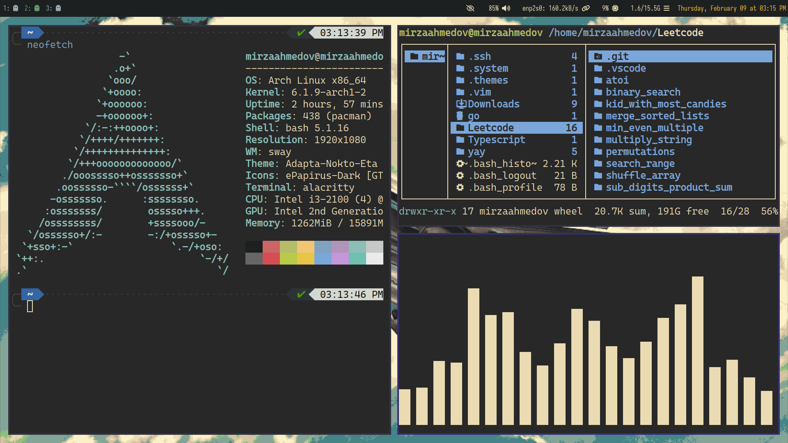

```
⠀⠀⠀⠀⠀⠀⠀⠀⠀⠀⠀⠀⠀⣸⣇⠀⠀⠀⠀⠀⠀⠀⠀⠀⠀⠀⠀⠀
⠀⠀⠀⠀⠀⠀⠀⠀⠀⠀⠀⠀⢰⣿⣿⡆⠀⠀⠀⠀⠀⠀⠀⠀⠀⠀⠀⠀
⠀⠀⠀⠀⠀⠀⠀⠀⠀⠀⠀⢠⣿⣿⣿⣿⡄⠀⠀⠀⠀⠀⠀⠀⠀⠀⠀⠀
⠀⠀⠀⠀⠀⠀⠀⠀⠀⠀⠀⢿⣿⣿⣿⣿⣿⡄⠀⠀⠀⠀⠀⠀⠀⠀⠀⠀
⠀⠀⠀⠀⠀⠀⠀⠀⠀⢀⣷⣤⣙⢻⣿⣿⣿⣿⡀⠀⠀⠀⠀⠀⠀⠀⠀⠀
⠀⠀⠀⠀⠀⠀⠀⠀⢀⣿⣿⣿⣿⣿⣿⣿⣿⣿⣿⡀⠀⠀⠀⠀⠀⠀⠀⠀
⠀⠀⠀⠀⠀⠀⠀⢠⣾⣿⣿⣿⣿⣿⣿⣿⣿⣿⣿⣷⡄⠀⠀⠀⠀⠀⠀⠀
⠀⠀⠀⠀⠀⠀⢠⣿⣿⣿⣿⣿⡿⠛⠛⠿⣿⣿⣿⣿⣿⡄⠀⠀⠀⠀⠀⠀
⠀⠀⠀⠀⠀⢠⣿⣿⣿⣿⣿⠏⠀⠀⠀⠀⠙⣿⣿⣿⣿⣿⡄⠀⠀⠀⠀⠀
⠀⠀⠀⠀⣰⣿⣿⣿⣿⣿⣿⠀⠀⠀⠀⠀⠀⢿⣿⣿⣿⣿⠿⣆⠀⠀⠀⠀
⠀⠀⠀⣴⣿⣿⣿⣿⣿⣿⣿⠀⠀⠀⠀⠀⠀⣿⣿⣿⣿⣿⣷⣦⡀⠀⠀⠀
⠀⢀⣾⣿⣿⠿⠟⠛⠋⠉⠉⠀⠀⠀⠀⠀⠀⠉⠉⠙⠛⠻⠿⣿⣿⣷⡀⠀
⣠⠟⠋⠁⠀⠀⠀⠀⠀⠀⠀⠀⠀⠀⠀⠀⠀⠀⠀⠀⠀⠀⠀⠀⠈⠙⠻⣄
```
# My archlinux setup



- Window Manager - Hyprland
- Display Server - Wayland
- Terminal - Alacritty
- Launcher - Dmenu
- Browser - Firefox
